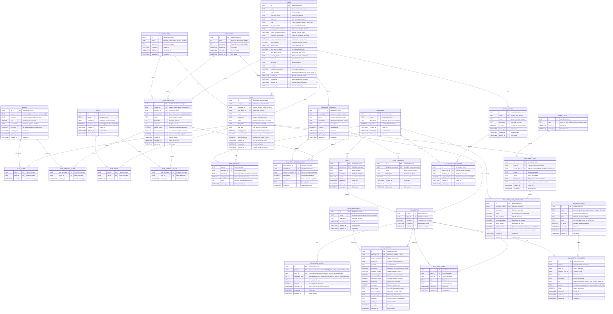

```mermaid
erDiagram
    USERS ||--o{ PLANS : has
    USERS ||--o{ PLAN_TEMPLATES : created
    USERS ||--o{ DISCIPLINE_TEMPLATES : created
    OBJECTIVES ||--o{ PLANS : includes
    OBJECTIVES ||--o{ PLAN_TEMPLATES : includes
    PLAN_STATUSES ||--o{ PLANS : defines
    PLAN_STATUSES ||--o{ PLAN_TEMPLATES : defines
    PLANS ||--o{ PLAN_EXAMS : includes
    EXAMS ||--o{ PLAN_EXAMS : included_by
    PLAN_TEMPLATES ||--o{ PLAN_TEMPLATE_EXAMS : includes
    EXAMS ||--o{ PLAN_TEMPLATE_EXAMS : included_by
    PLANS ||--o{ PLAN_ROLES : linked_to
    ROLES ||--o{ PLAN_ROLES : contains
    PLAN_TEMPLATES ||--o{ PLAN_TEMPLATE_ROLES : linked_to
    ROLES ||--o{ PLAN_TEMPLATE_ROLES : contains
    PLANS ||--o{ PLAN_DISCIPLINES : has
    PLAN_TEMPLATES ||--o{ PLAN_TEMPLATE_DISCIPLINES : has
    DISCIPLINES ||--o{ PLAN_DISCIPLINES : defines
    DISCIPLINES ||--o{ PLAN_TEMPLATE_DISCIPLINES : defines
    DISCIPLINES ||--o{ TOPICS : contains
    DISCIPLINE_TEMPLATES ||--o{ PLAN_TEMPLATE_DISCIPLINES : defines
    DISCIPLINE_TEMPLATES ||--o{ TOPIC_TEMPLATES : contains
    PLANS ||--o{ PLAN_TOPICS : has
    TOPICS ||--o{ PLAN_TOPICS : defines
    PLAN_TOPICS ||--o{ STUDY_RECORDS : has
    PLAN_TOPICS ||--o{ SCHEDULED_REVIEWS : has
    STUDY_CATEGORIES ||--o{ STUDY_RECORDS : categorizes
    PLAN_TOPICS ||--o{ PLAN_TOPIC_LINKS : has
    PLAN_TOPIC_LINKS }o--|| PLAN_TOPICS : belongs_to
    USERS ||--o{ STUDY_CYCLES : owns
    STUDY_CYCLES ||--o{ STUDY_CYCLE_DISCIPLINES : includes
    DISCIPLINES ||--o{ STUDY_CYCLE_DISCIPLINES : defined_by
    PLANS ||--o{ SIMULATED_EXAMS : has
    EXAM_STYLES ||--o{ SIMULATED_EXAMS : defines
    SIMULATED_EXAMS ||--o{ SIMULATED_EXAM_DISCIPLINES : includes
    DISCIPLINES ||--o{ SIMULATED_EXAM_DISCIPLINES : included
    RESOURCE_TYPES ||--o{ PLAN_TOPIC_RESOURCES : defines
    PLAN_TOPICS ||--o{ PLAN_TOPIC_RESOURCES : has

    USERS {
        UUID id PK "Identificador único"
        TEXT name "Nome completo do usuário"
        TEXT email "Email de login"
        TEXT password_hash "Senha criptografada"
        TEXT avatar_url "URL da imagem de perfil"
        TEXT role "Papel do usuário (student, admin, etc)"
        BOOLEAN is_email_verified "Se o email foi verificado"
        TEXT email_verification_token "Token de verificação de email"
        TIMESTAMP email_verification_sent_at "Data do envio do token"
        TEXT password_reset_token "Token de redefinição de senha"
        TIMESTAMP password_reset_expires_at "Validade do token de senha"
        INTEGER login_attempts "Tentativas de login inválidas"
        TIMESTAMP locked_until "Conta bloqueada até"
        BOOLEAN two_factor_enabled "Se 2FA está habilitado"
        TEXT two_factor_secret "Segredo do 2FA (TOTP)"
        TEXT session_token "Token de sessão persistente"
        TEXT timezone "Fuso horário preferido"
        TEXT language "Idioma preferido"
        DATE birth_date "Data de nascimento"
        BOOLEAN notifications_enabled "Se deseja notificações"
        TEXT auth_provider "Provedor de autenticação (email, google...)"
        TIMESTAMP created_at "Data de criação da conta"
        TIMESTAMP updated_at "Última atualização do usuário"
        TIMESTAMP deleted_at "Deleção lógica (soft delete)"
        TIMESTAMP last_login_at "Data do último login"
    }

    PLANS {
        UUID id PK "Identificador único do plano"
        UUID user_id FK "Referência ao dono do plano"
        UUID objective_id FK "Objetivo do plano (OAB, concurso...)"
        UUID plan_status_id FK "Status atual do plano"
        TEXT name "Nome do plano de estudo"
        TEXT image_url "Imagem de capa do plano"
        TEXT notes "Notas ou observações do usuário"
        DATE start_date "Data de início (opcional)"
        DATE end_date "Data de término (opcional)"
        INTEGER weekly_hours "Horas disponíveis por semana"
        BOOLEAN review_enabled "Revisão espaçada está habilitada?"
        INTEGER[] review_intervals "Intervalos de revisão (1,7,15...)"
        TIMESTAMP created_at "Data de criação do plano"
        TIMESTAMP updated_at "Última atualização"
        TIMESTAMP deleted_at "Deleção lógica (soft delete)"
    }

    PLAN_TEMPLATES {
        UUID id PK "Identificador único do template"
        UUID created_by FK "Usuário criador (admin, moderador...)"
        UUID objective_id FK "Objetivo do plano"
        UUID plan_status_id FK "Status do template (ex: published, draft)"
        TEXT name "Nome do plano modelo"
        TEXT description "Descrição opcional"
        TEXT image_url "Imagem ilustrativa"
        INTEGER weekly_hours "Carga horária semanal sugerida"
        BOOLEAN review_enabled "Se recomenda revisão espaçada"
        INTEGER[] review_intervals "Intervalos de revisão sugeridos"
        TIMESTAMP created_at "Data de criação"
        TIMESTAMP updated_at "Última atualização"
        TIMESTAMP deleted_at "Soft delete"
    }

    OBJECTIVES {
        UUID id PK "Identificador único"
        TEXT name "Nome do objetivo (ex: ENEM)"
        TEXT description "Descrição opcional do objetivo"
        TIMESTAMP created_at "Criado em"
        TIMESTAMP updated_at "Atualizado em"
        TIMESTAMP deleted_at "Soft delete"
    }

    PLAN_STATUSES {
        UUID id PK "Identificador único"
        TEXT name "Nome do status (active, paused, finished)"
        TEXT description "Descrição do status"
        TIMESTAMP created_at "Criado em"
        TIMESTAMP updated_at "Atualizado em"
        TIMESTAMP deleted_at "Soft delete"
    }

    EXAMS {
        UUID id PK "Identificador único"
        TEXT name "Nome do edital (ex: Técnico Bancário 2025)"
        TEXT institution "Instituição responsável pelo edital"
        INTEGER year "Ano da prova (opcional)"
        TEXT description "Descrição opcional do edital"
        BOOLEAN is_active "Se está visível/ativo na plataforma"
        TIMESTAMP created_at "Criado em"
        TIMESTAMP updated_at "Atualizado em"
        TIMESTAMP deleted_at "Soft delete"
    }

    PLAN_EXAMS {
        UUID plan_id FK "Plano associado"
        UUID exam_id FK "Edital associado"
        TIMESTAMP created_at "Data da associação"
    }

    PLAN_TEMPLATE_EXAMS {
        UUID plan_template_id FK "Template associado"
        UUID exam_id FK "Edital associado"
        TIMESTAMP created_at "Data da associação"
    }

    ROLES {
        UUID id PK "Identificador único"
        TEXT name "Nome do cargo"
        TEXT description "Descrição opcional do cargo"
        BOOLEAN is_active "Se o cargo está ativo no sistema"
        TIMESTAMP created_at "Criado em"
        TIMESTAMP updated_at "Atualizado em"
        TIMESTAMP deleted_at "Soft delete"
    }

    PLAN_ROLES {
        UUID plan_id FK "Plano associado"
        UUID role_id FK "Cargo associado"
        TIMESTAMP created_at "Data da associação"
    }

    PLAN_TEMPLATE_ROLES {
        UUID plan_template_id FK "Template associado"
        UUID role_id FK "Cargo associado"
        TIMESTAMP created_at "Data da associação"
    }

    DISCIPLINES {
        UUID id PK "Identificador único"
        TEXT name "Nome da disciplina"
        TEXT description "Descrição opcional da disciplina"
        BOOLEAN is_active "Se está ativa no sistema"
        TIMESTAMP created_at "Criado em"
        TIMESTAMP updated_at "Atualizado em"
        TIMESTAMP deleted_at "Soft delete"
    }

    PLAN_DISCIPLINES {
        UUID plan_id FK "Plano associado"
        UUID discipline_id FK "Disciplina associada"
        INTEGER percentage "Porcentagem da carga horária (opcional)"
        INTEGER weekly_hours "Horas semanais (opcional)"
        TEXT color "Cor para representar a disciplina"
        TIMESTAMP created_at "Data da associação"
    }

    PLAN_TEMPLATE_DISCIPLINES {
        UUID plan_template_id FK "Template associado"
        UUID discipline_id FK "Disciplina associada"
        UUID discipline_template_id FK "Disciplina modelo associada"
        INTEGER percentage "Porcentagem sugerida"
        INTEGER weekly_hours "Horas semanais sugeridas"
        TEXT color "Cor sugerida"
        TIMESTAMP created_at "Data da associação"
    }

    TOPICS {
        UUID id PK "Identificador único"
        UUID discipline_id FK "Disciplina associada"
        TEXT name "Nome do tópico"
        TEXT description "Descrição do tópico"
        BOOLEAN is_active "Se o tópico está ativo"
        TIMESTAMP created_at "Criado em"
        TIMESTAMP updated_at "Atualizado em"
        TIMESTAMP deleted_at "Soft delete"
    }

    PLAN_TOPICS {
        UUID plan_id FK "Plano associado"
        UUID topic_id FK "Tópico associado"
        BOOLEAN completed "Se o tópico foi concluído"
        TIMESTAMP created_at "Data da associação"
        TIMESTAMP updated_at "Última atualização"
    }

    DISCIPLINE_TEMPLATES {
        UUID id PK "Identificador único"
        UUID created_by FK "Criado por (usuário ou admin)"
        TEXT name "Nome da disciplina modelo"
        TEXT description "Descrição da disciplina modelo"
        TEXT color "Cor sugerida"
        BOOLEAN is_active "Se está ativa"
        TIMESTAMP created_at "Criado em"
        TIMESTAMP updated_at "Atualizado em"
        TIMESTAMP deleted_at "Soft delete"
    }

    TOPIC_TEMPLATES {
        UUID id PK "Identificador único"
        UUID discipline_template_id FK "Disciplina modelo associada"
        TEXT name "Nome do tópico modelo"
        TEXT description "Descrição do tópico"
        BOOLEAN is_active "Se está ativo"
        TIMESTAMP created_at "Criado em"
        TIMESTAMP updated_at "Atualizado em"
        TIMESTAMP deleted_at "Soft delete"
    }

    STUDY_CATEGORIES {
        UUID id PK "Identificador único"
        TEXT name "Nome da categoria (teoria, revisão, questões)"
        TEXT description "Descrição opcional"
        TIMESTAMP created_at "Criado em"
        TIMESTAMP updated_at "Atualizado em"
        TIMESTAMP deleted_at "Soft delete"
    }

    STUDY_RECORDS {
        UUID id PK "Identificador único"
        UUID plan_topic_id FK "Referência ao plano + tópico"
        UUID study_category_id FK "Categoria do estudo"
        TIME study_time "Tempo de estudo (hh:mm:ss)"
        TEXT material "Material utilizado"
        BOOLEAN completed "Se o tópico foi concluído neste estudo"
        BOOLEAN schedule_reviews "Deseja agendar revisões?"
        INTEGER questions_right "Questões certas (opcional)"
        INTEGER questions_wrong "Questões erradas (opcional)"
        INTEGER start_page "Página inicial (opcional)"
        INTEGER end_page "Página final (opcional)"
        TEXT video_name "Nome da videoaula (opcional)"
        TIME video_start_time "Timestamp inicial do vídeo"
        TIME video_end_time "Timestamp final do vídeo"
        TEXT comment "Comentário livre sobre o estudo"
        DATE studied_at "Data do estudo"
        TIMESTAMP created_at "Criado em"
        TIMESTAMP updated_at "Atualizado em"
    }

    SCHEDULED_REVIEWS {
        UUID id PK "Identificador único"
        UUID plan_id FK "Plano de estudo associado UNIQUE(plan_id, topic_id, scheduled_date)"
        UUID topic_id FK "Tópico associado UNIQUE(plan_id, topic_id, scheduled_date)"
        DATE scheduled_date "Data planejada para revisão UNIQUE(plan_id, topic_id, scheduled_date)"
        BOOLEAN completed "Se a revisão foi feita"
        BOOLEAN ignored "Se a revisão foi ignorada"
        TIMESTAMP completed_at "Data e hora da conclusão da revisão"
        TIMESTAMP created_at "Criado em"
        TIMESTAMP updated_at "Atualizado em"
    }

    PLAN_TOPIC_LINKS {
        UUID id PK "Identificador único do link"
        UUID plan_id FK "Plano associado"
        UUID topic_id FK "Tópico associado"
        TEXT title "Título do link"
        TEXT url "Endereço do link"
        TIMESTAMP created_at "Criado em"
        TIMESTAMP updated_at "Atualizado em"
    }

    STUDY_CYCLES {
        UUID id PK "Identificador único do ciclo"
        UUID user_id FK "Usuário dono do ciclo"
        TEXT name "Nome do ciclo de estudos"
        TEXT description "Descrição opcional"
        BOOLEAN is_active "Se está em uso atualmente"
        TIMESTAMP created_at "Criado em"
        TIMESTAMP updated_at "Atualizado em"
        TIMESTAMP deleted_at "Soft delete"
    }

    STUDY_CYCLE_DISCIPLINES {
        UUID id PK "Identificador único"
        UUID study_cycle_id FK "Ciclo de estudo associado"
        UUID discipline_id FK "Disciplina associada"
        INTEGER target_minutes "Minutos alvo para essa disciplina"
        TIMESTAMP created_at "Criado em"
        TIMESTAMP updated_at "Atualizado em"
    }

    SIMULATED_EXAMS {
        UUID id PK "Identificador único"
        UUID plan_id FK "Plano associado ao simulado"
        UUID exam_style_id FK "Estilo da prova (múltipla escolha ou certo/errado)"
        TEXT name "Nome do simulado"
        TEXT board "Banca do simulado"
        TIME time_spent "Tempo total gasto no simulado"
        DATE simulated_at "Data em que o simulado foi realizado"
        TIMESTAMP created_at "Criado em"
        TIMESTAMP updated_at "Atualizado em"
    }

    EXAM_STYLES {
        UUID id PK "Identificador único"
        TEXT name "Nome do estilo (Múltipla Escolha, Certo/Errado)"
        TIMESTAMP created_at "Criado em"
        TIMESTAMP updated_at "Atualizado em"
    }

    SIMULATED_EXAM_DISCIPLINES {
        UUID id PK "Identificador único"
        UUID simulated_exam_id FK "Simulado associado"
        UUID discipline_id FK "Disciplina associada"
        INTEGER weight "Peso da disciplina no simulado"
        INTEGER total_questions "Total de questões"
        INTEGER correct_answers "Quantidade de acertos"
        INTEGER wrong_answers "Quantidade de erros"
        INTEGER blank_answers "Deixadas em branco (apenas para Certo/Errado)"
        TEXT comment "Comentário sobre a disciplina no simulado"
        TIMESTAMP created_at "Criado em"
        TIMESTAMP updated_at "Atualizado em"
    }

    RESOURCE_TYPES {
        UUID id PK "Identificador único"
        TEXT name "Nome do tipo de recurso (ex: resumo, imagem, PDF, link)"
        TEXT description "Descrição opcional do tipo"
        TEXT icon "Nome do ícone ou caminho"
        TEXT color "Cor associada ao tipo (ex: #FFD700)"
        BOOLEAN is_active "Se o tipo está ativo para uso"
        TIMESTAMP created_at "Criado em"
        TIMESTAMP updated_at "Atualizado em"
        TIMESTAMP deleted_at "Soft delete"
    }

    PLAN_TOPIC_RESOURCES {
        UUID id PK "Identificador único"
        UUID plan_id FK "Plano de estudo associado"
        UUID topic_id FK "Tópico associado"
        UUID resource_type_id FK "Tipo do recurso"
        TEXT title "Título do recurso"
        TEXT description "Descrição opcional"
        TEXT url "URL ou caminho do arquivo (PDF, imagem, vídeo, etc)"
        TEXT content "Conteúdo textual (usado por resumos, flashcards, etc)"
        INTEGER order "Ordem de exibição"
        TIMESTAMP created_at "Criado em"
        TIMESTAMP updated_at "Atualizado em"
        TIMESTAMP deleted_at "Soft delete"
    }
```
