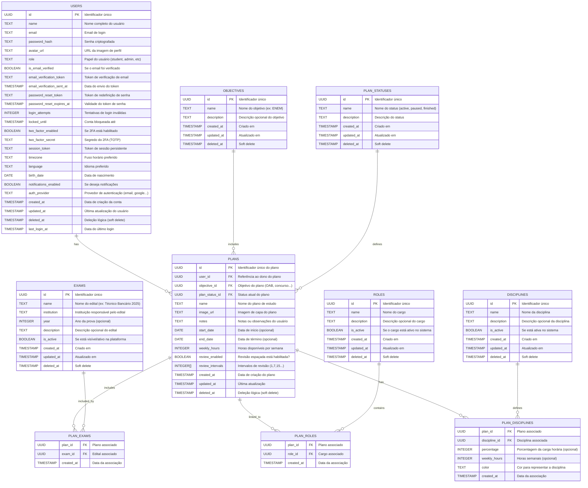

```mermaid
erDiagram
    USERS ||--o{ PLANS : has
    OBJECTIVES ||--o{ PLANS : includes
    PLAN_STATUSES ||--o{ PLANS : defines
    PLANS ||--o{ PLAN_EXAMS : includes
    EXAMS ||--o{ PLAN_EXAMS : included_by
    PLANS ||--o{ PLAN_ROLES : linked_to
    ROLES ||--o{ PLAN_ROLES : contains
    PLANS ||--o{ PLAN_DISCIPLINES : has
    DISCIPLINES ||--o{ PLAN_DISCIPLINES : defines

    USERS {
        UUID id PK "Identificador único"
        TEXT name "Nome completo do usuário"
        TEXT email "Email de login"
        TEXT password_hash "Senha criptografada"
        TEXT avatar_url "URL da imagem de perfil"
        TEXT role "Papel do usuário (student, admin, etc)"
        BOOLEAN is_email_verified "Se o email foi verificado"
        TEXT email_verification_token "Token de verificação de email"
        TIMESTAMP email_verification_sent_at "Data do envio do token"
        TEXT password_reset_token "Token de redefinição de senha"
        TIMESTAMP password_reset_expires_at "Validade do token de senha"
        INTEGER login_attempts "Tentativas de login inválidas"
        TIMESTAMP locked_until "Conta bloqueada até"
        BOOLEAN two_factor_enabled "Se 2FA está habilitado"
        TEXT two_factor_secret "Segredo do 2FA (TOTP)"
        TEXT session_token "Token de sessão persistente"
        TEXT timezone "Fuso horário preferido"
        TEXT language "Idioma preferido"
        DATE birth_date "Data de nascimento"
        BOOLEAN notifications_enabled "Se deseja notificações"
        TEXT auth_provider "Provedor de autenticação (email, google...)"
        TIMESTAMP created_at "Data de criação da conta"
        TIMESTAMP updated_at "Última atualização do usuário"
        TIMESTAMP deleted_at "Deleção lógica (soft delete)"
        TIMESTAMP last_login_at "Data do último login"
    }

    PLANS {
        UUID id PK "Identificador único do plano"
        UUID user_id FK "Referência ao dono do plano"
        UUID objective_id FK "Objetivo do plano (OAB, concurso...)"
        UUID plan_status_id FK "Status atual do plano"
        TEXT name "Nome do plano de estudo"
        TEXT image_url "Imagem de capa do plano"
        TEXT notes "Notas ou observações do usuário"
        DATE start_date "Data de início (opcional)"
        DATE end_date "Data de término (opcional)"
        INTEGER weekly_hours "Horas disponíveis por semana"
        BOOLEAN review_enabled "Revisão espaçada está habilitada?"
        INTEGER[] review_intervals "Intervalos de revisão (1,7,15...)"
        TIMESTAMP created_at "Data de criação do plano"
        TIMESTAMP updated_at "Última atualização"
        TIMESTAMP deleted_at "Deleção lógica (soft delete)"
    }

    OBJECTIVES {
        UUID id PK "Identificador único"
        TEXT name "Nome do objetivo (ex: ENEM)"
        TEXT description "Descrição opcional do objetivo"
        TIMESTAMP created_at "Criado em"
        TIMESTAMP updated_at "Atualizado em"
        TIMESTAMP deleted_at "Soft delete"
    }

    PLAN_STATUSES {
        UUID id PK "Identificador único"
        TEXT name "Nome do status (active, paused, finished)"
        TEXT description "Descrição do status"
        TIMESTAMP created_at "Criado em"
        TIMESTAMP updated_at "Atualizado em"
        TIMESTAMP deleted_at "Soft delete"
    }

    EXAMS {
        UUID id PK "Identificador único"
        TEXT name "Nome do edital (ex: Técnico Bancário 2025)"
        TEXT institution "Instituição responsável pelo edital"
        INTEGER year "Ano da prova (opcional)"
        TEXT description "Descrição opcional do edital"
        BOOLEAN is_active "Se está visível/ativo na plataforma"
        TIMESTAMP created_at "Criado em"
        TIMESTAMP updated_at "Atualizado em"
        TIMESTAMP deleted_at "Soft delete"
    }

    PLAN_EXAMS {
        UUID plan_id FK "Plano associado"
        UUID exam_id FK "Edital associado"
        TIMESTAMP created_at "Data da associação"
    }

    ROLES {
        UUID id PK "Identificador único"
        TEXT name "Nome do cargo"
        TEXT description "Descrição opcional do cargo"
        BOOLEAN is_active "Se o cargo está ativo no sistema"
        TIMESTAMP created_at "Criado em"
        TIMESTAMP updated_at "Atualizado em"
        TIMESTAMP deleted_at "Soft delete"
    }

    PLAN_ROLES {
        UUID plan_id FK "Plano associado"
        UUID role_id FK "Cargo associado"
        TIMESTAMP created_at "Data da associação"
    }

    DISCIPLINES {
        UUID id PK "Identificador único"
        TEXT name "Nome da disciplina"
        TEXT description "Descrição opcional da disciplina"
        BOOLEAN is_active "Se está ativa no sistema"
        TIMESTAMP created_at "Criado em"
        TIMESTAMP updated_at "Atualizado em"
        TIMESTAMP deleted_at "Soft delete"
    }

    PLAN_DISCIPLINES {
        UUID plan_id FK "Plano associado"
        UUID discipline_id FK "Disciplina associada"
        INTEGER percentage "Porcentagem da carga horária (opcional)"
        INTEGER weekly_hours "Horas semanais (opcional)"
        TEXT color "Cor para representar a disciplina"
        TIMESTAMP created_at "Data da associação"
    }
```
